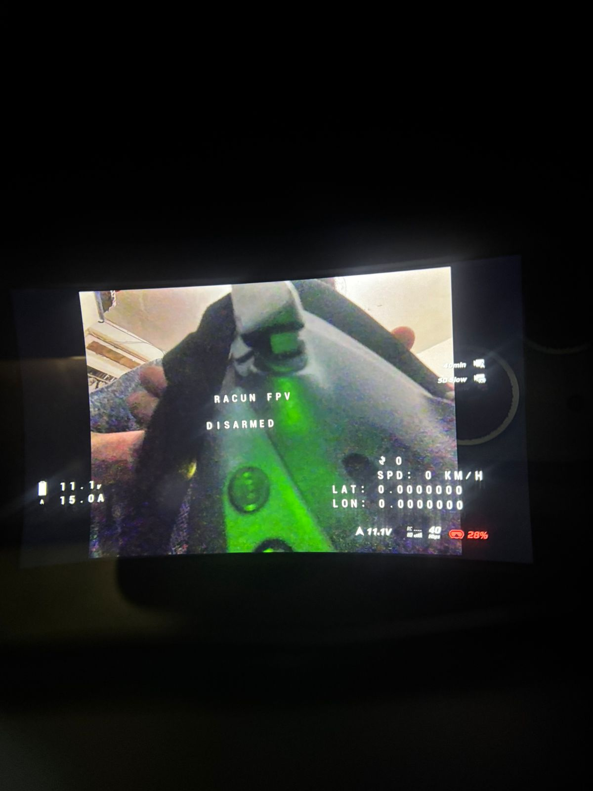

# ESP32 OSD With DJI MSP Displayport

This project uses an **ESP32-C3** microcontroller to emulate a flight controller and send custom On-Screen Display (OSD) data to a DJI FPV Video Transmitter using the MultiWii Serial Protocol (MSP) and MSP DisplayPort. 

It reads real GPS telemetry from a serial GPS module and monitors battery voltage using a hardware voltage divider, forwarding all of this in real-time to your DJI Goggles so you can have a custom OSD without needing a standard Betaflight/INAV flight controller.

**Tested with:** DJI O4 Air Unit and DJI O4 Pro.

## Demo

**Arming Simulation (Enables full power on DJI O4):**

<video src="assets/simulate-arming.mp4" controls="controls" width="400" height="400" style="transform: rotate(-90deg);"></video>

## Features
- **Real-time GPS Parsing:** Uses the `TinyGPS++` library to read latitude, longitude, speed, altitude, and satellite count via a hardware UART.
- **Hardware Battery Monitoring:** Measures battery voltage (up to ~36V for 6S Lipos) using a simple resistor divider and the ESP32-C3's internal ADC.
- **Arming Switch:** Physical switch input to toggle the "ARMED" / "DISARMED" state on the OSD.
- **Custom OSD Layout:** Displays custom text (e.g., "RACUN FPV") and telemetry directly on the DJI canvas using DisplayPort commands.

---

## Schematic & Wiring

### 1. DJI VTX Connection (MSP)
The ESP32-C3 communicates with the DJI VTX via its primary hardware UART (`Serial0`) at 115200 baud.
- **ESP32-C3 TX** ➔ **DJI VTX RX**
- **ESP32-C3 RX** ➔ **DJI VTX TX**
- **GND** ➔ **DJI VTX GND**

*(Note: On many ESP32-C3 boards, Serial0 is mapped to GPIO 21 for TX and GPIO 20 for RX, but check your specific development board's pinout).*

### 2. GPS Module
The GPS module uses `HardwareSerial 1` to ensure reliable communication without tying up CPU resources. You can easily change these pins in the code.
- **GPS TX** ➔ **ESP32-C3 Pin 4** (`GPS_RX_PIN`)
- **GPS RX** ➔ **ESP32-C3 Pin 5** (`GPS_TX_PIN`)
- **GPS VCC** ➔ **3.3V or 5V** (depending on your GPS module)
- **GPS GND** ➔ **GND**

### 3. Battery Voltage Divider (ADC)
To safely measure lipo battery voltage, an 11:1 voltage divider is used. 
*⚠️ **WARNING:** Never connect battery voltage directly to the ESP32 pins, as it will destroy the board.*
- Connect a **10kΩ resistor** from **Battery Positive (+)** to **ESP32-C3 Pin 3** (`VBAT_PIN`).
- Connect a **1kΩ resistor** from **ESP32-C3 Pin 3** to **GND**.
- The code scales this down and converts it. If your readings are slightly off due to resistor tolerances, you can adjust the `VBAT_CALIBRATION` multiplier at the top of the sketch.

### 4. Arming Switch (Full Power Unlock)
- Connect a physical toggle switch between **ESP32-C3 Pin 9** and **GND**.
- When the switch is closed (Pin 9 pulled low to GND), the OSD will display `* ARMED *` and change the MSP flag to armed.
- **Important for DJI O4:** Simulating this arming state is required to unlock full transmission power on the O4 Air Unit.
- When open, it displays `DISARMED` and the VTX remains in low power mode.

---

## How It Works

1. **Initialization:** On startup, the ESP32-C3 configures the MSP serial port, the GPS serial port, and the ADC pins.
2. **MSP Polling:** The DJI VTX constantly requests data by sending specific commands (like `MSP_STATUS`, `MSP_ANALOG`, `MSP_RAW_GPS`). The `loop()` function intercepts these requests via `processMSPRequest()` and responds with the current system state, battery values, and GPS data mimicking a real flight controller.
3. **GPS Parsing:** In the background, `TinyGPS++` constantly decodes incoming NMEA sentences from the GPS module on UART1. As soon as a valid 3D fix is acquired, the global GPS variables are updated.
4. **Battery Monitoring:** Every 200ms, the ESP32-C3 reads the analog value on Pin 3. It calculates the actual voltage using the reference voltage (3.3V) and resistor values (`R1` and `R2`), converting it into the format expected by MSP (where 1V is sent as an integer `10`).
5. **DisplayPort OSD:** Also every 200ms, `updateOSD()` sends specific DisplayPort commands to clear the canvas, draw the battery voltage, amperage, GPS stats, and custom text at specific column/row coordinates on the screen.

## Dependencies & Installation

1. Install the **ESP32 Board Package** in the Arduino IDE and select **ESP32C3 Dev Module** (or your specific board).
2. Install the **TinyGPSPlus** library by Mikal Hart (available in the Arduino IDE Library Manager).
3. Ensure the DJI VTX is configured to expect MSP/DisplayPort OSD on its configured UART.
4. Compile and upload to your ESP32-C3.
